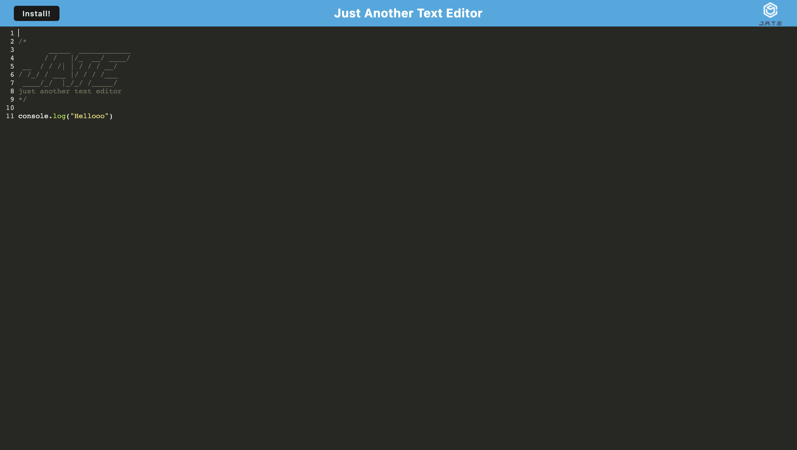

# Coding Bootcamp Week 19 Challenge - Text Editor

## Description

This weeks challenge focused on adding the finishing touches to a PWA text editor. A service worker was added so the app could run if the server was down, a manifest was created so the app could be installed. And, indexedDB was used to store what the user writes on the text editor.

## Built With

- JavaScript
- NodeJS
  - Dependencies
    - express
    - if-env
    - code-mirror-themes
    - idb
  - Dev Dependencies
    - @babel/core
    - @babel/plugin-transform-runtime
    - @babel/preset-env
    - @babel/runtime
    - babel-loader
    - css-loader
    - html-webpack-plugin
    - http-server
    - style-loader
    - webpack
    - webpack-cli
    - webpack-dev-server
    - webpack-pwa-manifest
    - workbox-webpack-plugin
    - concurrently
    - nodemon

## Installation

Below are instructions on how to install and use this application:

```md
npm install
```

To start both the client and server side

```md
npm start
```

## Usage

To access the website, click the link below. Click the install button to install the application onto your computer/laptop.



## Credits

Made by [Brodie Marshall](https://github.com/brodie02)

---
